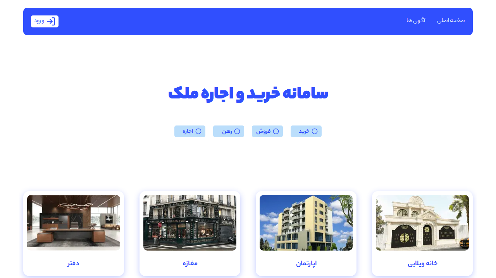

# 🏠 Smart Real Estate Platform

<div align="center">

A modern and intelligent platform for buying, selling, and renting properties, developed with Next.js and MongoDB.


</div>

---

<div align="center">
  
</div>

---

## 📝 About The Project

This project is a comprehensive platform for managing and searching real estate listings, designed to provide a smooth and modern user experience. Users can easily view, search, and post listings. It also features a powerful admin panel for administrators and a dedicated user dashboard.

### ✨ Key Features

- **Advanced Search:** Filter properties by category (villa, apartment, store, office).
- **Authentication System:** Secure user registration and login using Next-Auth.
- **User Dashboard:** Manage personal listings and user information.
- **Admin Panel:** Full control over listings and users for the admin.
- **Responsive Design:** Seamless user experience on both desktop and mobile.
- **Dynamic Pagination:** Efficient loading and display of listings.

---

## 🛠️ Built With

This project was developed using the latest web technologies:

* **[Next.js](https://nextjs.org/):** A React framework for building modern and optimized web applications.
* **[React](https://reactjs.org/):** A popular library for building dynamic user interfaces.
* **[MongoDB](https://www.mongodb.com/):** A NoSQL database for flexible data storage.
* **[Mongoose](https://mongoosejs.com/):** A tool for modeling MongoDB data.
* **[Next-Auth](https://next-auth.js.org/):** A complete solution for handling authentication in Next.js projects.
* **[React Icons](https://react-icons.github.io/react-icons/):** A collection of beautiful and useful icons.

---

## 🚀 Getting Started

To set up the project locally, follow the steps below.

### Prerequisites

- **Node.js:** Version 18.x or higher.
- **MongoDB:** An instance of MongoDB (you can use MongoDB Atlas for free).

### Installation

1. **Clone the repository:**
   First, clone the project from the main repository.

2. **Install dependencies:**
   ```sh
   npm install
   ```

3. **Set up environment variables:**
   Create a `.env.local` file in the project root and add the following variables:
   ```env
   MONGODB_URI=your_mongodb_connection_string
   NEXTAUTH_SECRET=your_super_secret_key
   ```

4. **Run the project:**
   ```sh
   npm run dev
   ```
   You can now view the project at `http://localhost:3000`.

---

## 📂 Project Structure

The overall project structure is designed to be simple and maintainable:

```
├── public/              # Static files (images, fonts)
├── src/
│   ├── app/             # Main routes and pages (Routing)
│   │   ├── (auth)/      # Registration and login pages
│   │   ├── admin/       # Admin panel
│   │   ├── api/         # API routes
│   │   └── dashboard/   # User dashboard
│   ├── components/      # Reusable components
│   │   ├── module/      # More complex components
│   │   └── template/    # Main page templates
│   ├── models/          # Database models (Mongoose Schemas)
│   ├── providers/       # Context Providers
│   └── utils/           # Helper functions and tools
├── .eslintrc.json
├── next.config.js
└── package.json
```